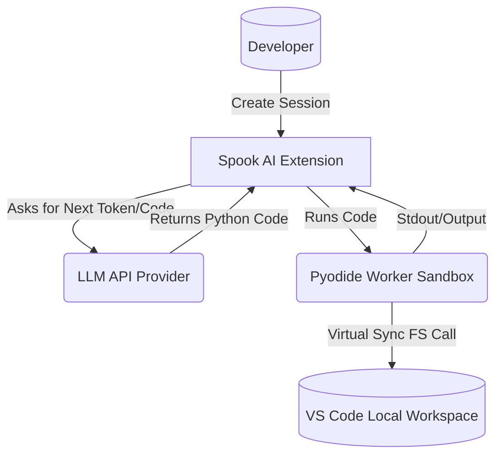

# 3. System Scope and Context

## 3.1 Business Context
Spook AI exists to act as an advanced AI pair programmer, moving beyond chat and autocomplete into agentic workflows where the LLM is an autonomous executor. 

- **User:** Instigates RLM sessions, provides original prompts, and controls visibility filtering configuration. Eventually, the user reviews and commits changes.
- **LLM API Provider:** External service that takes the system prompt + user prompts + outputs from the Pyodide environment, and replies with standard text or python source code snippets.

## 3.2 Technical Context
- **VS Code Workspace:** The agent functions within the active workspace.
- **Pyodide Environment:** A sandboxed WebAssembly execution environment executing CPython.
- **MCP Servers & Tools:** External context providers or command tools that the extension exposes via recursive functions (`subagent`, `ask`, `print`, etc.).

