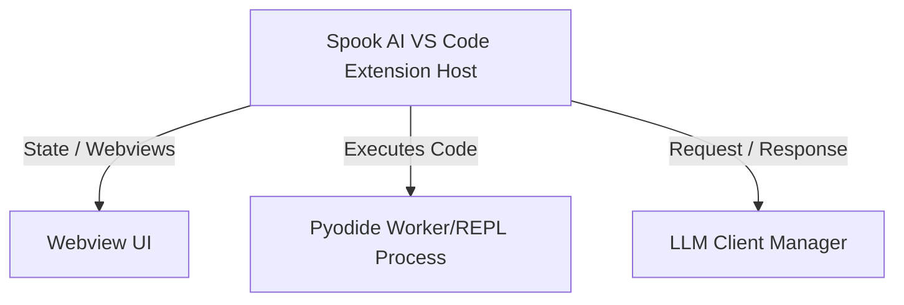

# 5. Building Block View

## 5.1 Level 1 View

## 5.2 Level 2 View (Core Extension Components)
- **SessionManagementService:** Responsible for reading/writing JSON files from `.spook/sessions`, orchestrating the webview interface (`SessionManagementViewProvider`), and rendering messages.
- **FS Bridge (CoW Backend):** Exposes `node_ops` and `stream_ops`, effectively mediating between Pyodide calls and `vscode.workspace.fs`. Validates paths and enacts file filtering rules (e.g., hiding `.git` or `node_modules`).
- **Synchronous API Client:** Built via `@vscode/sync-api-client`, managing the `SharedArrayBuffer` logic that bridges Pyodide to the async VS Code Extension Host process.
- **Tools/MCP Registry:** Orchestrates the injection of available globals (like `context.tools.subagent()`) into Pyodide.
