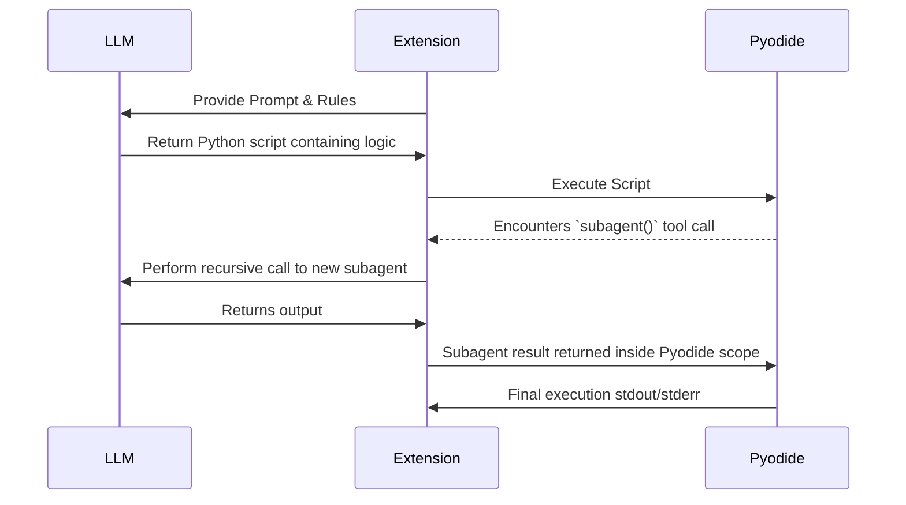

# 6. Runtime View

## 6.1 Agent Execution Cycle
1. **Trigger:** User sends a request in the Session Webview UI.
2. **Context Assembly:** Extension builds a prompt including the workspace context, hidden/shown paths, and injected globals.
3. **LLM Invocation:** The prompt is delivered to the LLM Provider.
4. **Code Delivery:** Code block extracted from the LLM.
5. **Execution:** Code is run within Pyodide asynchronously. 
6. **I/O Operations:** 
   - Operations like `os.listdir()` trigger `node_ops.readdir()`.
   - File opens with `w` trigger a fetch from VSCode workspace, caching into `MEMFS` before the write.
7. **Return:** Stdout/Stderr output is passed back to the LLM in a recursive loop until the LLM resolves the requirement or triggers `context.tools.ask()`.

## 6.2 Recursive Interaction

